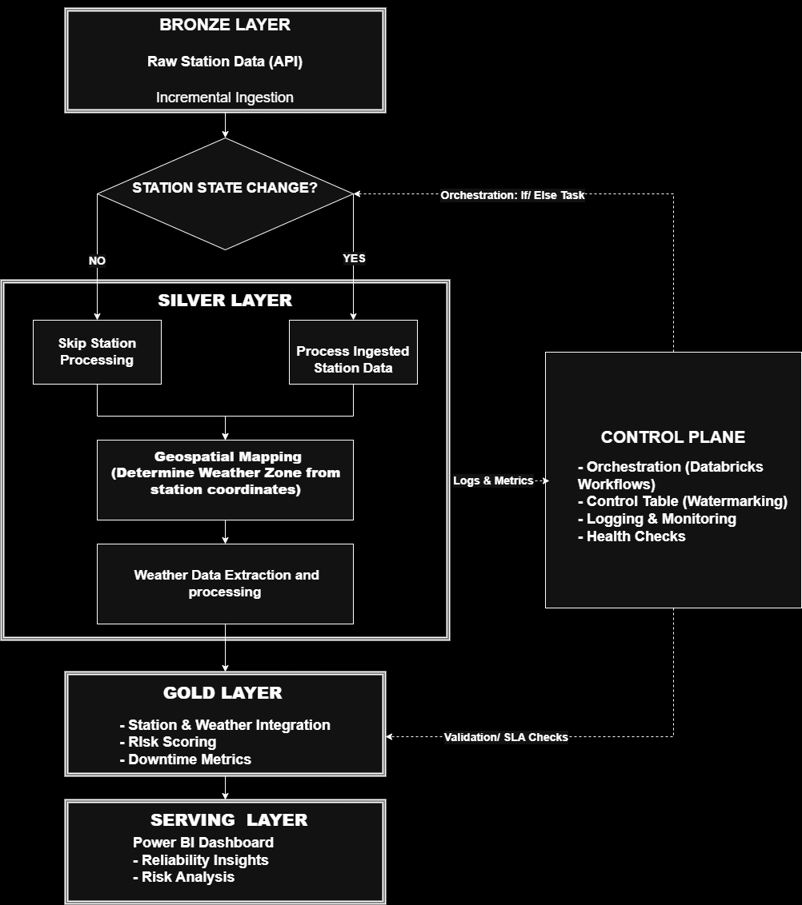
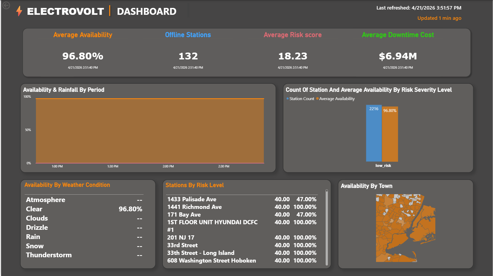

# ⚡ Project Voltstream

> Built with: Databricks | PySpark | Delta Lake

EV charging infrastructure is increasingly vulnerable to operational disruptions caused by extreme weather conditions. However, there is limited visibility into how environmental factors impact station availability, reliability, and downtime.

This project builds an end-to-end **scalable data pipeline** to analyze how weather conditions affect EV charging station performance and identify infrastructure at risk of failure.

---

## 🎯 Overview

This system ingests 2,000+ EV charging station records and weather data across 50+ geospatial zones within a defined bounding box covering New York City and parts of New Jersey. It uses a 5-minute scheduled incremental ingestion pipeline, designed to support high-frequency data sources, and processes data through a scalable medallion architecture to produce analytics-ready datasets for operational analysis.

It enables data-driven understanding of:

* Station availability under varying weather conditions
* Downtime patterns and operational reliability
* Infrastructure risk under extreme environmental events
* Financial impact of downtime events

---

## 🔧 Tech Stack

**Data Processing**  
• PySpark 3.5+ | Delta Lake | Databricks Runtime 13.3 LTS

**Languages & Frameworks**  
• Python 3.10 | SQL | Databricks Workflows

**Data Sources**  
• Open Charge Map API | OpenWeatherMap API | REST

**Infrastructure**  
• Unity Catalog | Databricks Secrets | GitHub Actions CI/CD

**Testing & Quality**  
• pytest | flake8 | black | pylint | 40+ unit tests

**Visualization**  
• Power BI | SQL Analytics

---

## 🏗️ Architecture

The solution is implemented using a **medallion architecture on Databricks**.


**External APIs → Bronze → Silver → Gold → Analytics**




### 🔹 Bronze Layer (Raw Ingestion)

* Raw JSON ingestion from Open Charge Map API
* Deduplication using unique identifiers
* Incremental ingestion with checkpointing
* Append-only storage design

### 🔹 Silver Layer (Cleaned & Conformed Data)

* Schema normalization and data standardization
* Data quality validation and quarantine handling
* SCD Type 2 implementation for historical tracking
* Geospatial weather aggregation and enrichment

### 🔹 Gold Layer (Analytics-Ready Data)

* Station–weather integration logic
* Downtime and availability calculations
* Risk scoring model for station failure probability
* Cost impact estimation of downtime events

### 🔹 Serving Layer (Downstream Analytics)

* Power BI dashboard for operational monitoring  
* KPIs on station availability, downtime, and cost impact  
* Business-ready views for analyzing reliability trends across time and regions  



---

## ⚡ Key Capabilities

* End-to-end medallion architecture pipeline (Bronze → Silver → Gold) for EV charging and weather data integration
* Framework for correlating environmental conditions with EV station operational status
* Scalable ingestion design supporting incremental API-based data collection
* Historical tracking of station state using SCD Type 2 modeling
* Data transformation layer enabling availability, downtime, and reliability computations
* Risk scoring framework for identifying stations exposed to adverse weather conditions
* Analytics-ready Gold layer designed for BI consumption and dashboarding tools such as Microsoft Power BI
* Modular pipeline design supporting extension to real-time or high-frequency data sources

---

## 💡 Example Use Cases

* Identifying EV stations at risk during severe weather events  
* Monitoring downtime trends across geographic regions  
* Supporting infrastructure planning and maintenance prioritization  

---

## 📈 Performance Metrics

* **Data Volume**: 2,216 EV stations across NYC + NJ, 53 weather zones, 500K+ records processed
* **Pipeline Latency**: <3 minutes per incremental batch (5-minute intervals)
* **Query Performance**: Sub-second response time for gold layer aggregations
* **Test Coverage**: 85% code coverage across 40+ unit and integration tests
* **Optimization**: Z-ORDER indexing reduces query time by 60% on filtered lookups
* **Data Quality**: 5.7% of invalid records caught and quarantined before entering silver layer

---

## 🛠️ Setup & Installation

**Complete setup guide available in [docs/setup.md](docs/setup.md)**

Quick start for experienced users:

1. **Get API Keys**: [Open Charge Map](https://openchargemap.org/site/develop/api) + [OpenWeatherMap](https://openweathermap.org/api)
2. **Configure Secrets**: Store keys in Databricks secret scope `project_voltstream`
3. **Clone Repo**: Use Databricks Repos or upload manually
4. **Create Catalogs**: `bronze_dev`, `silver_dev`, `gold_dev` with `electrovolt` schema
5. **Run Pipeline**: Execute notebooks or import Workflow
6. **Verify**: Run health check script

📖 **[Full Setup Instructions →](docs/setup.md)**

---

## 🧠 Engineering Design

### 🔄 Data Processing Strategy

* Incremental ingestion to avoid full dataset recomputation
* Idempotent pipeline design for safe reprocessing
* Column pruning and filtered reads for performance optimization
* API call minimization through conditional ingestion logic
* Incremental ingestion using watermarking with control tables to track last processed timestamps, minimizing full table scans and improving pipeline efficiency

### 🧬 Data Model

The data model separates normalized operational data (Silver) from analytics-optimized structures (Gold).

#### 🔹 Silver Layer (Normalized Model)
* dim_station_scd2 – Station dimension with SCD Type 2 history
* fact_connectors – Connector-level station data (child entity of stations)
* fact_weather – Time-series weather observations

This layer maintains normalized relationships and historical state tracking.

#### 🔹 Gold Layer (Star Schema)

Designed for analytics at a timestamp-level grain:

* fact_station_status – Central fact table capturing station status, downtime, and risk metrics per timestamp
* dim_station – Current station attributes
* dim_weather – Standardized weather dimension

#### Relationship Overview

Silver models operational relationships, while Gold is optimized for analytical queries combining station behavior and weather conditions over time.

```text
SILVER LAYER
────────────
dim_station_scd2 → fact_connectors
        |
        v
fact_weather

GOLD LAYER
──────────
dim_station  dim_weather
      \        /
       \      /
   fact_station_status
```

### ⚙️ Performance Optimization

* Periodic OPTIMIZE operations for Delta file compaction and improved read performance  
* Z-ORDER applied on time and region columns, reducing filtered query time by ~60%  
* Optimized data layout to minimize scan overhead and improve analytical query performance  

---

## 📊 Data Quality & Observability

* Validation checks at Silver and Gold layers
* Data freshness SLA monitoring (<48 hours)
* Control tables for pipeline tracking and lineage
* Failure blocking on critical data quality issues

---

## 🔁 Orchestration

Pipeline orchestration is implemented using **Databricks Workflows**, structured as a dependency-aware DAG.

### Features:

* Parallel execution of independent tasks
* Conditional execution to reduce compute cost
* Fail-fast validation checkpoints
* Idempotent task execution design

---

## 🧪 Testing & CI/CD

### Testing

* 40+ unit tests covering transformation logic
* End-to-end integration tests for pipeline validation
* Utility-level function coverage for core modules

### CI/CD (GitHub Actions)

* Automated testing via pytest
* Code quality checks (flake8, black, pylint)
* Security scanning (bandit, safety)
* Automated deployment to Databricks environment

---

## ⚠️ Limitations

* The Open Charge Map dataset is community-maintained and does not provide high-frequency or real-time operational updates for EV stations
* Due to limited event granularity, the dataset does not fully capture short-duration outages or rapid state transitions
* As a result, the system is designed to validate pipeline correctness, scalability, and transformation logic, rather than produce statistically robust operational insights
* Certain analytical outputs (e.g., downtime frequency and weather correlation strength) should be interpreted as demonstrative rather than predictive in nature
* The architecture is intentionally designed to accommodate higher-resolution telemetry or IoT-based data sources in production environments

---

## 🛠️ Mitigation Strategy

* Simulated incremental data changes to validate pipeline robustness
* Designed system to support high-frequency streaming sources in production
* Ensured scalability and idempotency for real-time ingestion scenarios

---

## 🚀 Production Readiness Checklist

* ✔ Incremental ingestion pipeline
* ✔ SCD Type 2 historical modeling
* ✔ Workflow-based orchestration
* ✔ Data quality enforcement layer
* ✔ CI/CD automation pipeline
* ✔ Observability and monitoring design

---

## 🔌 Data Sources

* Open Charge Map — EV charging station metadata
* OpenWeatherMap — weather and environmental conditions

---

## 👤 Author

**Ekemini udo** | Data Engineer

📧 nseekeminiudo@gmail.com  
💼 [LinkedIn](https://www.linkedin.com/in/nseekeminiudo)  
🐙 [GitHub](https://github.com/nseekeminiudo)  

Specializing in scalable data pipelines, distributed systems, and analytics engineering on Databricks. Open to full-time data engineering opportunities and interesting technical challenges.
